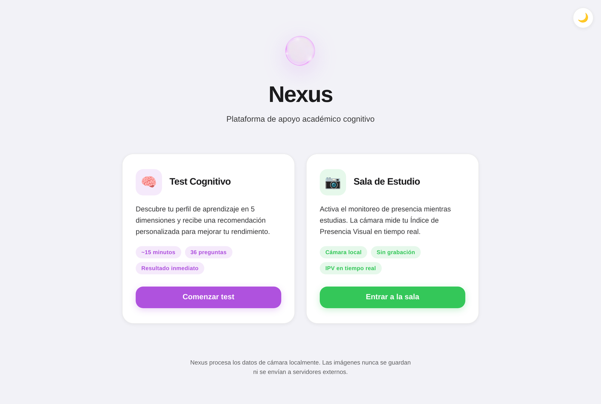
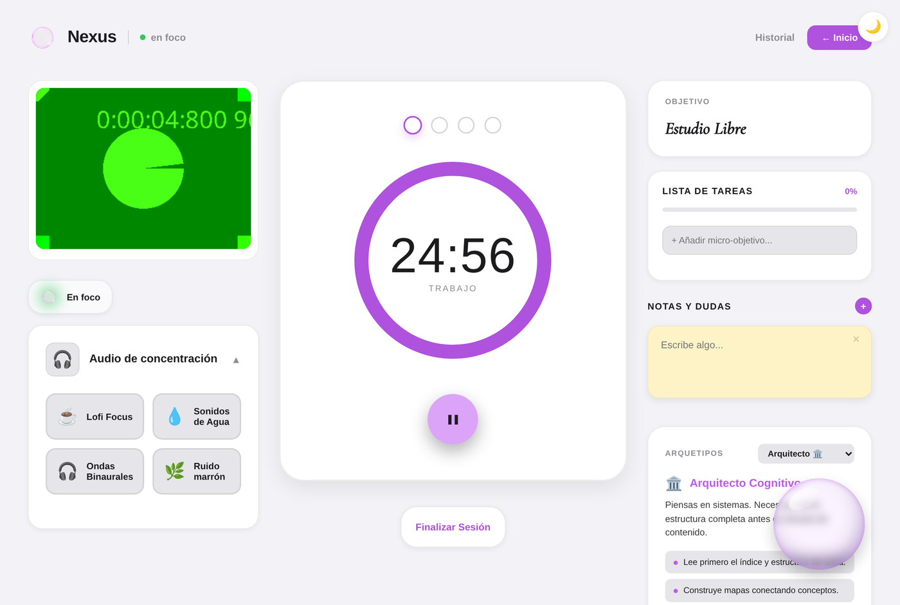
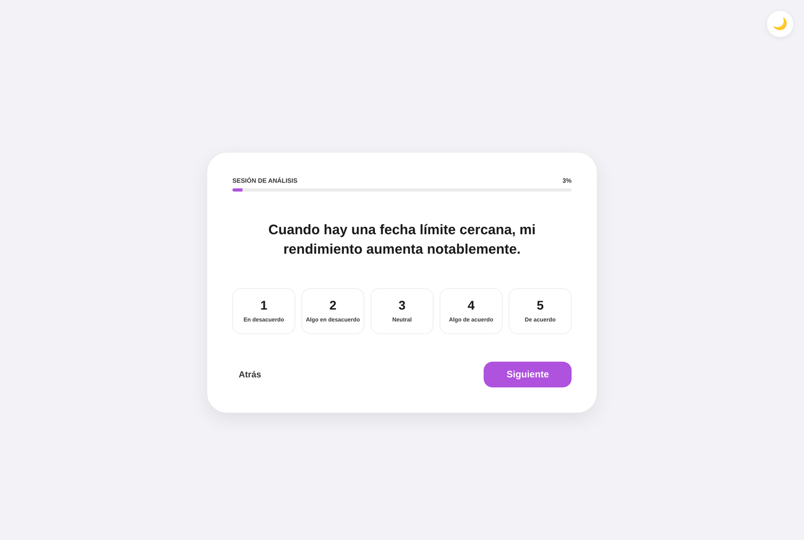
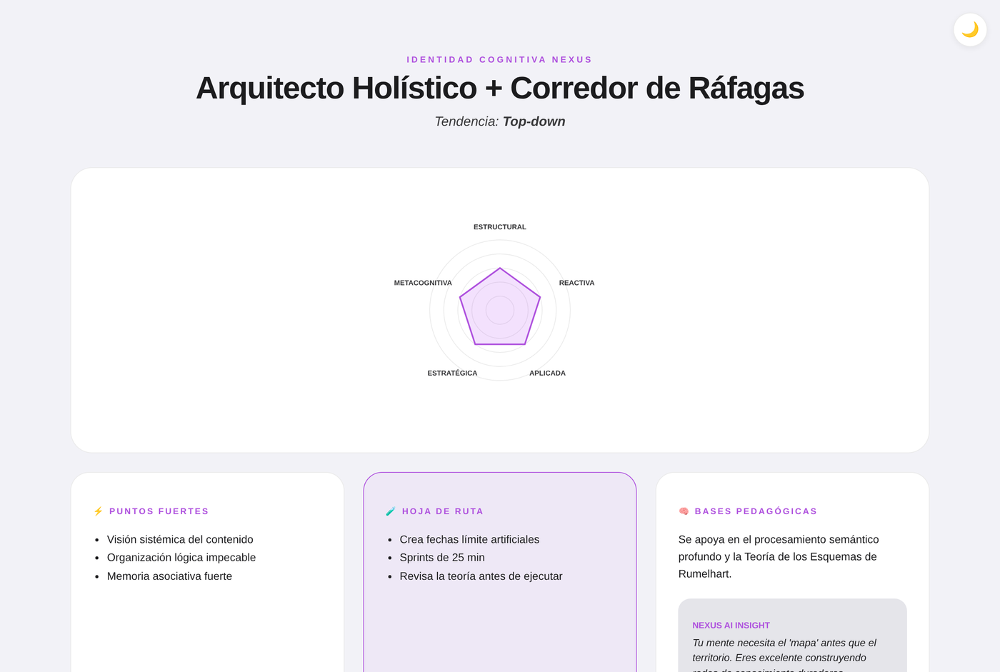
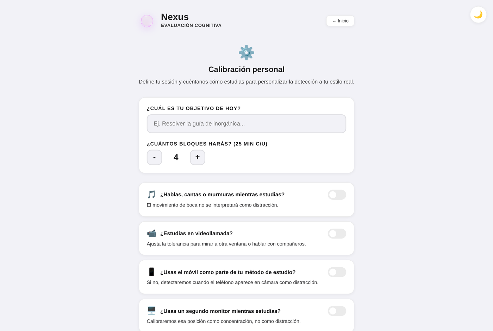
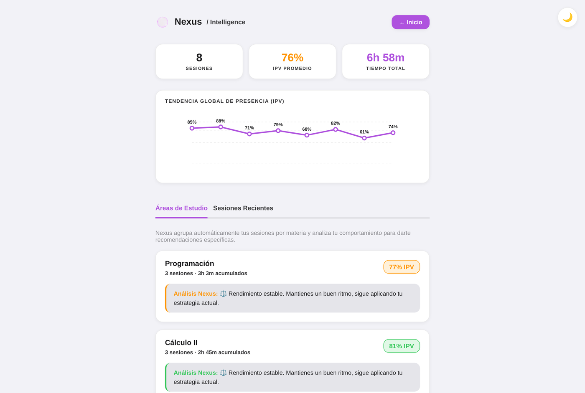

<p align="right"><a href="README.en.md">🇬🇧 English version</a></p>

# 🧠 Nexus

**Plataforma de apoyo académico cognitivo.** Combina un test psicométrico de estilos de aprendizaje con una sala de estudio que usa la cámara del propio dispositivo para medir el nivel de presencia y concentración en tiempo real — todo procesado en el navegador, sin backend ni envío de datos a servidores externos.

> Proyecto personal construido de principio a fin (producto, diseño de la métrica y código) para explorar visión por computador en el navegador y aprendizaje automático on-device aplicados a un problema real: por qué nos cuesta mantenernos concentrados al estudiar.

<p align="center">
  
  
</p>

---

## ¿Qué hace?

### 1. Test cognitivo (36 ítems)
Un cuestionario psicométrico propio que mide 5 dimensiones del estilo de aprendizaje — **Estructural, Reactiva, Aplicada, Estratégica y Metacognitiva** — con ítems invertidos, preguntas de validez (para detectar respuestas poco fiables) y un bloque bipolar para determinar la tendencia *top-down / bottom-up*. El resultado se traduce en un **arquetipo de aprendizaje** (Arquitecto, Corredor, Ingeniero, Estratega, Adaptativo…) con técnicas de estudio recomendadas y su base científica de referencia (Rumelhart, Kolb, Zimmerman, Flavell).

<p align="center">
  
  
</p>

### 2. Sala de estudio con seguimiento de presencia
Con permiso del usuario, la cámara analiza el frame cada 2 segundos usando **face-api.js** (TinyFaceDetector + landmarks faciales) y extrae un vector de 6 características normalizadas (yaw, pitch, brillo, tamaño relativo del rostro, simetría facial, presencia de manos). Ese vector se clasifica con un modelo **KNN** propio — calibrado por cada usuario en una sesión inicial de ~30 segundos, no un modelo pre-entrenado genérico — y se usa **K-Means** al final de cada sesión para detectar patrones de comportamiento nuevos que el modelo aún no conoce.

Con eso se calcula un **Índice de Presencia Visual (IPV)** por sesión, que queda registrado en un historial con gráfica de tendencia y calendario de racha de estudio.

<p align="center">
  
  
</p>

> La captura de la Sala de Estudio usa un dispositivo de cámara simulado (patrón de prueba estándar de Chromium) para tomar la screenshot sin exponer una cara real — el flujo y la interfaz son exactamente los de producción.

### 3. Ambiente de estudio
Modos de sonido para acompañar la sesión: Lofi, sonidos de agua, ondas binaurales (vía Spotify) y **ruido marrón generado matemáticamente con Web Audio API**, sin archivos de audio de por medio.

### 4. Extras
Notas rápidas durante la sesión, feedback post-sesión, historial con filtrado por materia, y tema claro/oscuro persistente.

---

## Privacidad por diseño

No es un eslogan de marketing: **no hay backend**. El vídeo nunca sale del navegador, no se graba ni se sube a ningún sitio — el frame se procesa en memoria y se descarta. Lo único que persiste es el vector numérico de 6 valores (no la imagen) y el modelo KNN, guardados en `localStorage` del propio dispositivo. Es una decisión de arquitectura, no solo de política de datos.

---

## Stack técnico

| Área | Tecnología |
|---|---|
| Framework | React 19 + React Router 7 |
| Visión por computador | face-api.js (TinyFaceDetector + landmarks 68 puntos), MediaPipe Hands |
| Machine learning | `ml-knn` (clasificación) + `ml-kmeans` (detección de patrones nuevos), 100% client-side |
| Audio | Web Audio API (síntesis de tonos y ruido, sin librerías externas) |
| Persistencia | `localStorage` (sin base de datos, sin servidor) |
| Build | Create React App / react-scripts |

---

## Instalación local

```bash
npm install
npm start
```

Abre `http://localhost:3000`. La app pedirá permiso de cámara al entrar a la Sala de Estudio; sin ese permiso, el resto de la plataforma (test cognitivo, historial, notas) funciona igual.

```bash
npm test    # tests con react-scripts/Testing Library
npm run build
```

---

## Estado del proyecto

Es un prototipo funcional, no un producto en producción: no tiene backend, cuentas de usuario ni sincronización entre dispositivos — todo vive en el `localStorage` del navegador donde se usa. El modelo de clasificación se calibra por persona y por sesión de navegador, así que su precisión depende de esa calibración inicial y de las condiciones de luz/cámara.

Cosas que tengo en el radar como siguientes pasos: persistencia fuera del navegador (para no perder el historial al limpiar caché), tests automatizados de los módulos de ML/features, y accesibilidad (navegación por teclado, lectores de pantalla) en las pantallas de test y sala de estudio.

---

## Sobre este proyecto

Lo construí para tener una excusa concreta de meterme a fondo en visión por computador en el navegador y ML on-device, con un enfoque explícito en que los datos sensibles (vídeo de la cara de alguien estudiando) nunca deberían necesitar salir del dispositivo para ser útiles. Si te interesa hablar del proyecto, del enfoque técnico o de posibles colaboraciones, escríbeme.
